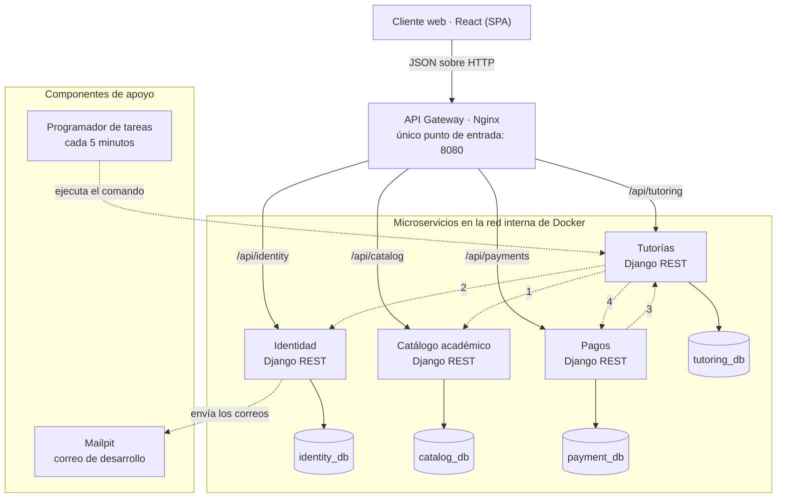

# Plataforma de Tutorías entre Estudiantes

Plataforma web que conecta a estudiantes de Duoc UC que necesitan apoyo en una
asignatura con compañeros que la dominan.

Proyecto APT · Capstone (PTY4614) · Ingeniería en Informática · Duoc UC · 2026

## Descripción

### Qué problema resuelve

Los estudiantes de Duoc UC recurren con frecuencia a compañeros de cursos
superiores para reforzar las asignaturas que les cuestan, pero esa búsqueda
ocurre de manera informal y dispersa: grupos de mensajería, recomendaciones de
pasillo y contactos personales. No existe un punto centralizado dentro de la
institución donde un estudiante pueda encontrar quién domina una asignatura,
conocer su reputación y coordinar un horario. La ayuda existe, pero no se
encuentra.

### Qué hace

La plataforma centraliza la oferta y la demanda de apoyo académico entre pares.
El producto mínimo viable (MVP) considera:

- Registro con el correo institucional @duocuc.cl, verificado con un enlace de
  un solo uso, e inicio y cierre de sesión.
- Perfil con carrera, nivel y sede.
- Catálogo académico con carreras, sedes, mallas, semestres y asignaturas. El
  modelo admite las 92 carreras de Duoc UC y parte con 3 a 5 carreras
  completas, cargadas desde archivos CSV.
- Declaración de las asignaturas en que un estudiante ofrece tutorías, con la
  tarifa que él mismo fija (puede ser $0). Solo se habilitan asignaturas de su
  malla ubicadas en semestres anteriores a su nivel.
- Publicación de bloques de disponibilidad, búsqueda de tutores por asignatura,
  solicitud de tutoría, confirmación o rechazo, y cancelación.
- Avisos por correo: al tutor cuando recibe una solicitud y al estudiante
  cuando se la confirman o rechazan.
- Historial de las tutorías solicitadas e impartidas.
- Evaluación de 1 a 5 después de cada sesión, con comentario opcional, y
  reputación visible de cada tutor.
- Pago simulado de la reserva, con reintento y reembolso simulado al cancelar.
- Panel de administración para gestionar usuarios y catálogo, y retirar
  evaluaciones.

La plataforma agenda la tutoría; la sesión ocurre de forma presencial o por un
enlace externo que el tutor indica al confirmar. Quedan fuera de esta versión
la videollamada integrada, el chat interno, la aplicación móvil nativa, los
pagos con dinero real y la integración con los sistemas académicos de Duoc UC,
incluido su inicio de sesión institucional.

### A quién va dirigido

A los estudiantes de Duoc UC. Estudiante y tutor no son cuentas distintas: una
misma persona puede pedir ayuda en los ramos que le cuestan y ofrecerla en los
de semestres anteriores al que cursa.

| Rol           | Qué hace en la plataforma                                                                                             |
| ------------- | --------------------------------------------------------------------------------------------------------------------- |
| Estudiante    | Busca tutores por asignatura, solicita una tutoría, paga (simulado), cancela o retira su solicitud y evalúa al tutor. |
| Tutor         | Declara asignaturas y tarifa, publica su disponibilidad, acepta o rechaza solicitudes y ve su reputación.             |
| Administrador | Gestiona usuarios y catálogo académico, retira evaluaciones y revisa la actividad del sistema.                        |

## Tecnologías utilizadas

| Capa                 | Tecnología                                                                                                                            |
| -------------------- | ------------------------------------------------------------------------------------------------------------------------------------- |
| Lenguajes            | Python 3.12 en el backend; JavaScript, HTML y CSS en el frontend                                                                      |
| Backend              | Django 5.2 y Django REST Framework 3.16, servidos con Gunicorn                                                                        |
| Frontend             | Planificado: React con Vite (HU-06). En evaluación, la alternativa AD-12: páginas en HTML, CSS y JavaScript servidas por el gateway en `/app/` (PR #10), que es lo que usa la demo |
| Base de datos        | PostgreSQL 16, una base independiente por microservicio                                                                               |
| API Gateway          | Nginx 1.27                                                                                                                            |
| Autenticación        | Tokens JWT firmados con RS256 (HU-05, PR #11; funciona en la demo)                                                                    |
| Correo               | Mailpit como servidor de correo de desarrollo                                                                                         |
| Contenedores         | Docker y Docker Compose: un Dockerfile por servicio y un `docker-compose.yml` que levanta el sistema completo                         |
| Calidad              | pytest, pytest-django y pytest-cov; ruff y black en Python; ESLint, Prettier y Vitest en el frontend (con HU-06)                      |
| Integración continua | GitHub Actions                                                                                                                        |
| Cloud                | No se usa. El sistema completo corre en contenedores Docker en cualquier computador; GitHub aloja el código y la integración continua |

## Instrucciones para ejecutar el proyecto localmente

### Requisitos

| Herramienta    | Versión mínima | Cómo comprobarlo                                  |
| -------------- | -------------- | ------------------------------------------------- |
| Git            | 2.40           | `git --version`                                   |
| Docker Desktop | 4.30           | `docker version` (línea `Server: Docker Desktop`) |
| Docker Compose | 2.27           | `docker compose version`                          |

En Windows, Docker Desktop necesita WSL 2 activado. El sistema completo usa
alrededor de 3 GB de memoria; si tu computador tiene 8 GB, cierra el navegador
mientras lo levantas la primera vez.

### Levantar el sistema

```bash
git clone https://github.com/Bacchi701/Plataforma-web-tutorias.git
cd Plataforma-web-tutorias
cp .env.example .env          # PowerShell: Copy-Item .env.example .env
docker compose up -d --build
```

`docker-compose.yml` construye cada servicio desde su
`services/<servicio>/Dockerfile` y levanta diez contenedores: el gateway, los
cuatro servicios, sus cuatro bases de datos y la bandeja de correo de
desarrollo. La primera vez tarda entre 3 y 6 minutos porque construye las
imágenes. Las siguientes, menos de un minuto.

### Comprobar que está arriba

Abre <http://localhost:8080>: la página muestra los cuatro servicios con su
estado. Uno por uno:

| Servicio           | URL                                            |
| ------------------ | ---------------------------------------------- |
| Identidad          | <http://localhost:8080/api/identity/v1/estado> |
| Catálogo académico | <http://localhost:8080/api/catalog/v1/estado>  |
| Tutorías           | <http://localhost:8080/api/tutoring/v1/estado> |
| Pagos              | <http://localhost:8080/api/payments/v1/estado> |

Cada uno responde algo así:

```json
{"servicio": "identity", "estado": "ok", "base_de_datos": "ok", "version": "0.1.0"}
```

Ningún servicio ni base de datos publica un puerto a tu computador: el puerto
8080 del gateway es la única puerta de entrada, que es justamente la condición
del criterio de aceptación CA8.

En `develop` están las historias ya terminadas (ver «Estado del desarrollo»).
El registro, el inicio de sesión y las páginas del frontend todavía esperan
revisión en sus Pull Request, y se pueden probar juntos en la rama de la demo.

### Probar la demo (rama `demo/semana-08`)

La rama `demo/semana-08` integra los Pull Request #5 a #12 para la
demostración: registro con el correo institucional, verificación por correo,
inicio de sesión y la página de asignaturas con la API de Catálogo. No se
fusiona: cada historia llega a `develop` por su propio Pull Request.

En Windows (PowerShell), desde la carpeta del repositorio:

```powershell
git switch demo/semana-08
Copy-Item .env.example .env -Force
docker compose build identity
docker compose run --rm --no-deps -v "${PWD}\keys:/claves" --entrypoint python identity manage.py generar_claves_jwt --carpeta /claves
docker compose up -d --build --wait
powershell -ExecutionPolicy Bypass -File .\scripts\cargar_datos_demo.ps1
```

En macOS o Linux, los mismos pasos en la terminal:

```bash
git switch demo/semana-08
cp .env.example .env
docker compose build identity
docker compose run --rm --no-deps -v "$(pwd)/keys:/claves" --entrypoint python identity manage.py generar_claves_jwt --carpeta /claves
docker compose up -d --build --wait
for par in identity_db:identity.sql catalog_db:catalog.sql tutoring_db:tutoring.sql payment_db:payments.sql; do
  servicio=${par%%:*}; archivo=${par##*:}
  docker compose cp "data/seeds/demo/$archivo" "$servicio:/tmp/$archivo"
  docker compose exec -T "$servicio" sh -c "psql -U \$POSTGRES_USER -d \$POSTGRES_DB -v ON_ERROR_STOP=1 -q -f /tmp/$archivo"
done
```

- El cuarto comando genera el par de claves que firma los tokens. La clave
  privada queda en `keys/` y no se sube al repositorio (la excluye
  `.gitignore`); la pública cambia, y Git la mostrará modificada: es normal y
  no hay que subirla.
- La carga de los datos de ejemplo vacía y vuelve a llenar las cuatro bases.
  Se puede repetir las veces que haga falta. Todos los datos son ficticios.

Después abre:

| Qué                                   | Dirección                                    |
| ------------------------------------- | -------------------------------------------- |
| Estado de los cuatro servicios        | <http://localhost:8080/>                     |
| Asignaturas y mallas (API de Catálogo) | <http://localhost:8080/app/asignaturas.html> |
| Registro con correo @duocuc.cl        | <http://localhost:8080/app/registro.html>    |
| Bandeja de correo (verificación)      | <http://localhost:8025>                      |
| Inicio de sesión                      | <http://localhost:8080/app/login.html>       |

Cuentas de ejemplo, todas con la clave `Tutorias2026`:

| Cuenta                     | Qué muestra                                         |
| -------------------------- | --------------------------------------------------- |
| `valentina.demo@duocuc.cl` | Cuenta verificada: entra y ve «Hola, Valentina».    |
| `tomas.demo@duocuc.cl`     | Cuenta sin verificar: no puede iniciar sesión.      |
| `josefa.demo@duocuc.cl`    | Cuenta desactivada: «Tu cuenta está desactivada.»   |

Una cuenta nueva se crea en el registro con cualquier correo que termine en
`@duocuc.cl`; el enlace de verificación llega a la bandeja de desarrollo, no a
una casilla real. Para volver a `develop`: `docker compose down` y
`git switch develop`.

### Variables de entorno

Todas viven en un solo archivo `.env` en la raíz, que se crea copiando
`.env.example` y nunca se sube al repositorio.

| Variables                                                        | Para qué sirven                                                                                     |
| ---------------------------------------------------------------- | --------------------------------------------------------------------------------------------------- |
| `PUERTO_GATEWAY`                                                 | Puerto del gateway en tu computador (8080 por defecto).                                             |
| `DJANGO_SECRET_KEY`, `DJANGO_DEBUG`, `DJANGO_ALLOWED_HOSTS`      | Configuración común de los cuatro servicios.                                                        |
| `IDENTITY_DB_*`, `CATALOG_DB_*`, `TUTORING_DB_*`, `PAYMENT_DB_*` | Nombre, usuario y contraseña de la base de cada servicio.                                           |
| `PUERTO_BANDEJA`                                                 | Puerto de la bandeja de correo de desarrollo (8025 por defecto).                                    |
| `EMAIL_*` y `CORREO_REMITENTE`                                   | Vacías por defecto, así todo el correo cae en Mailpit. Solo se llenan para la prueba de envío real. |
| `URL_FRONTEND`, `COOKIE_REFRESH_SEGURA`                          | Llegan con el registro y la sesión (PR #5 y #11; ya están en la rama de la demo): la página a la que lleva el enlace del correo de verificación y si la cookie de renovación de la sesión va marcada como segura. |

### Bandeja de correo de desarrollo

Todo correo que envía Identidad cae en Mailpit y se ve en
<http://localhost:8025>. Nada sale a internet: ningún correo llega a una
persona real. Para mandar uno de prueba:

```bash
docker compose exec identity python manage.py enviar_correo_prueba
```

La bandeja publica un segundo puerto, solo para tu computador (127.0.0.1). Es
una herramienta de desarrollo y no forma parte del sistema evaluado (Pilar 2,
sección 10). Se vacía cada vez que se reinicia su contenedor.

Mailpit no entrega a casillas reales. Para el envío real que exige el supuesto
S-02 del Pilar 5 (un correo de verificación que llegue a una casilla
@duocuc.cl) se llenan en el `.env` de un solo computador las variables
`EMAIL_HOST`, `EMAIL_PORT`, `EMAIL_HOST_USER`, `EMAIL_HOST_PASSWORD`,
`EMAIL_USE_TLS` (con el valor `1` si el servidor usa TLS) y
`CORREO_REMITENTE`, con una cuenta SMTP gratuita. Después,
`docker compose up -d` aplica los cambios a Identidad (`docker compose restart`
no relee el `.env`), y la prueba se envía con
`enviar_correo_prueba --para tu.casilla@duocuc.cl`. Esas claves nunca se suben
al repositorio.

## Integrantes del equipo con sus roles

| Integrante       | Autor en Git  | Rol en Scrum                                                    | Responsabilidades                                                                                                                                                                                                                                                   |
| ---------------- | ------------- | --------------------------------------------------------------- | ------------------------------------------------------------------------------------------------------------------------------------------------------------------------------------------------------------------------------------------------------------------- |
| Bryan Bacchi     | `Bacchi701`   | Líder del proyecto: Scrum Master, Product Owner y desarrollador | Dueño de los servicios de Identidad (con los avisos por correo) y Pagos. Responsable de la infraestructura: contenedores, gateway, correo de desarrollo e integración continua. Coordina al equipo, consolida la documentación y es el interlocutor con el docente. |
| Francisco Tejeda | `cacot12`     | Equipo de desarrollo                                            | Dueño del Catálogo académico y la carga de mallas, del módulo de evaluaciones y reputación, y del panel de administración. Construye la base del frontend en React y es el segundo responsable de infraestructura.                                                  |
| Damaris Iriarte  | `Damaris2023` | Equipo de desarrollo                                            | Dueña del servicio de Tutorías: perfiles de tutor, disponibilidad, búsqueda, reservas y cancelaciones. Responsable del sistema visual del frontend.                                                                                                                 |

Cada integrante es dueño de sus servicios de punta a punta (modelo de datos,
API, pruebas y pantallas), y cada servicio tiene un segundo responsable que
sabe levantarlo y revisarlo: Damaris en Identidad y Pagos, Bryan en Catálogo y
evaluaciones, y Francisco en Tutorías e infraestructura. Con tres integrantes,
los roles de Scrum Master y Product Owner se concentran en el líder, y el
equipo lo deja escrito en vez de simular una separación que no se ejerce.

## Metodología de trabajo del equipo: Scrum

El equipo trabaja con Scrum, adaptado a tres personas.

- **Sprints de dos semanas.** Cuatro sprints, del 21 de septiembre al 8 de
  noviembre de 2026 (el último dura una semana), precedidos por una semana de
  planificación y una de cimientos. El 25 de septiembre el profesor fijó el
  8 de noviembre como límite del desarrollo, y el plan pasó de cinco sprints a
  cuatro.
- **Product Backlog.** El alcance se priorizó con MoSCoW. El bloque Must, que
  es el MVP, se descompuso en 37 historias de usuario (13 de ellas técnicas),
  estimadas en horas (355 h en total) y agrupadas en nueve épicas. Los Should
  entran de a uno, y solo si la velocidad medida deja espacio.
- **Cierre de sprint** (90 minutos, cada dos semanas): Sprint Review, en la que
  cada dueño de servicio demuestra lo suyo funcionando; retrospectiva; reporte
  al docente; y Sprint Planning del sprint siguiente, sobre las horas que cada
  integrante declara. Al abrir cada sprint se congelan los contratos de la API
  que ese sprint va a usar.
- **Seguimiento en Jira.** Desde el sprint 2, por pedido del profesor, el
  backlog, el sprint y el Daily están en Jira (proyecto «Tutorias», clave
  SCRUM). El Daily es escrito: cada integrante deja un comentario por día hábil
  en SCRUM-51, con lo que hizo, lo que hará y sus bloqueos. Al cierre de cada
  sprint se comparan las horas planificadas con las trabajadas y con las
  historias terminadas.
- **Definición de Listo (Definition of Done).** Una historia está terminada
  cuando cumple su criterio de aceptación sobre el sistema levantado, tiene
  pruebas automáticas de sus reglas de negocio, la integración continua está
  en verde, otro integrante la aprobó, el contrato en `docs/api` refleja la API
  real, el sistema se levanta desde un clon limpio y la historia está fusionada
  a `develop`.

| Etapa         | Fechas                           | Objetivo                                                                        |
| ------------- | -------------------------------- | ------------------------------------------------------------------------------- |
| Planificación | 7 al 13 de septiembre            | Cinco pilares de planificación, repositorio y primeras maquetas                 |
| Cimientos     | 14 al 20 de septiembre           | El sistema completo se levanta con un comando                                   |
| Sprint 1      | 21 de septiembre al 4 de octubre | Registro, verificación de correo e inicio de sesión, sobre la base del frontend |
| Sprint 2      | 5 al 18 de octubre               | Cerrar lo abierto del sprint 1; perfil, catálogo cargado, declaración de asignaturas y disponibilidad |
| Sprint 3      | 19 de octubre al 1 de noviembre  | Búsqueda de tutores, solicitud, confirmación, avisos, cancelación, pago simulado, evaluaciones y programador de tareas |
| Sprint 4      | 2 al 8 de noviembre              | Panel de administración, pruebas de extremo a extremo y sistema visual; el desarrollo se congela el 8 de noviembre |
| Cierre        | 9 al 21 de noviembre             | Informe final y ensayo de la demostración                                       |

**Flujo en Git (GitFlow reducido).** `main` guarda la última versión
presentable y recibe `develop` al cierre de cada sprint, con su etiqueta (v0.1,
v0.2, v0.3 y v1.0). `develop` integra el trabajo del sprint. Cada historia nace de
`develop` en una rama corta (por ejemplo, `feat/HU-04-registro-usuario`) y
vuelve por Pull Request, con la integración continua en verde y la aprobación
de otro integrante.

## Arquitectura de la solución

Arquitectura de microservicios: cuatro servicios en Django REST Framework
detrás de un API Gateway en Nginx, cada uno con su propia base de datos
PostgreSQL, todo orquestado con Docker Compose.



El diagrama muestra el MVP completo: el frontend llega con HU-06 (en React o,
si se confirma la alternativa AD-12, como páginas servidas por el gateway en
`/app/`) y el programador de tareas con HU-37. Las flechas continuas son el tráfico del
cliente, que siempre entra por el gateway, y el acceso de cada servicio a su
propia base. Las punteadas son llamadas internas por la red privada:

| N.º | Llamada              | Para qué                                                                |
| --- | -------------------- | ----------------------------------------------------------------------- |
| 1   | Tutorías → Catálogo  | Valida la asignatura contra la malla y el nivel del usuario (RN-01).    |
| 2   | Tutorías → Identidad | Obtiene los datos del usuario y pide el envío de los avisos por correo. |
| 3   | Pagos → Tutorías     | Consulta la reserva y avisa el resultado del pago.                      |
| 4   | Tutorías → Pagos     | Pide el reembolso al cancelar una reserva pagada.                       |

Qué hace cada servicio:

| Servicio           | Prefijo            | Responsabilidad                                                                                                                           | Base de datos |
| ------------------ | ------------------ | ----------------------------------------------------------------------------------------------------------------------------------------- | ------------- |
| Identidad          | `/api/identity/v1` | Registro, verificación del correo institucional, sesión y tokens, datos del usuario, marca de administrador y envío de todos los correos. | `identity_db` |
| Catálogo académico | `/api/catalog/v1`  | Carreras, sedes, mallas, semestres, asignaturas y prerrequisitos; búsqueda de asignaturas e importación desde CSV.                        | `catalog_db`  |
| Tutorías           | `/api/tutoring/v1` | Perfiles de tutor y tarifas, disponibilidad, búsqueda de tutores, reservas y su ciclo de vida, evaluaciones y reputación.                 | `tutoring_db` |
| Pagos              | `/api/payments/v1` | Pago simulado de una reserva, su estado y el reembolso. Es un componente desactivable.                                                    | `payment_db`  |

Decisiones que sostienen el diseño:

- **Un solo punto de entrada.** El gateway es el único componente del sistema
  que publica un puerto (8080). Los servicios y las bases viven en una red
  interna de Docker y no son alcanzables desde fuera; la bandeja de correo de
  desarrollo abre otro puerto, solo en 127.0.0.1.
- **Cada servicio es dueño de sus datos.** Ninguno consulta la base de otro;
  todo cruce ocurre por la API REST del servicio dueño del dato.
- **Comunicación síncrona REST con JSON.** Hay cuatro llamadas internas entre
  servicios, numeradas en el diagrama. Las rutas `/internal` no pasan por el
  gateway.
- **Autenticación distribuida.** Solo Identidad emite los tokens JWT, firmados
  con RS256; los demás servicios verifican la firma con la clave pública.
- **Copias de lectura.** Tutorías guarda una copia de los datos del usuario y
  de la asignatura que necesita para resolver la búsqueda de tutores sin una
  llamada HTTP por resultado. Se acepta consistencia eventual: las copias se
  refrescan en el ciclo del programador de tareas.
- **Componentes de apoyo.** Mailpit recibe los correos en desarrollo sin
  enviarlos a personas reales, y el programador de tareas ejecuta cada cinco
  minutos los comandos de Tutorías que cierran reservas, expiran solicitudes y
  sincronizan las copias de lectura.

Las decisiones de arquitectura con sus alternativas, los contratos de interfaz
y el modelo de datos completo están en el Pilar 2 y su anexo A, en
[`docs/planificacion/`](docs/planificacion/). Los diagramas entidad-relación
de las cuatro bases están en [`docs/diagramas/`](docs/diagramas/).

## Estructura del repositorio

```text
Fase 1/              evidencias de la Fase 1 del Capstone (grupales e individuales)
Fase 2/              evidencias de la Fase 2: individuales, grupales y del proyecto
.github/workflows/   canal de integración continua
docs/                planificación, diagramas, contratos OpenAPI, decisiones y evidencia
infra/nginx/         configuración del gateway y página de estado
infra/postgres/      scripts de inicialización de PostgreSQL
services/            identity, catalog, tutoring y payments, cada uno con su Dockerfile
data/seeds/          archivos CSV para cargar el catálogo
keys/                clave pública de firma de tokens (la privada no se versiona)
scripts/             carga del catálogo y sincronización manual
*.html, css/, js/    maquetas del frontend; pasan a frontend/ con HU-06
docker-compose.yml   levanta el sistema completo
.env.example         variables de entorno de ejemplo, sin secretos
```

Las carpetas `infra/postgres/`, `data/seeds/`, `keys/` y `scripts/` ya existen
y se llenan con las historias que las usan.

## Estado del desarrollo

Al 9 de octubre de 2026, en el sprint 2:

- **En `develop`:** los cimientos (HU-01), el correo de desarrollo (HU-02) y
  el modelo de Tutorías (HU-08, Pull Request #7, fusionado el 9 de octubre).
- **En revisión**, cada historia en su Pull Request y con la integración
  continua en verde: registro y verificación del correo (HU-04, #5), modelo
  del catálogo (HU-07, #6), modelo de pagos (HU-23, #8), API de Catálogo
  (HU-12, #9), páginas del frontend en `/app/` (HU-06, #10), inicio y cierre de
  sesión (HU-05, #11) y pantallas de registro e inicio de sesión (HU-09, #12).
- **En la rama `demo/semana-08`** funciona desde el 2 de octubre el objetivo
  del sprint 1: registro con el correo institucional, verificación e inicio de
  sesión (ver «Probar la demo»).
- **Pendiente del sprint 1:** el contrato OpenAPI de Identidad (HU-03) y la
  versión v0.1 en `main`.
- **Alcance:** desde el 5 de octubre, de forma provisoria, el panel de
  administración se limita a consultar y desactivar usuarios (escalón 3 del
  plan de recorte).
- **Más adelante:** el programador de tareas llega con HU-37, en el sprint 3.

## Comandos del día a día

```bash
docker compose ps                  # qué hay levantado y cómo está
docker compose logs -f identity    # seguir los registros de un servicio
docker compose restart identity    # reiniciar uno (no relee el .env)
docker compose down                # apagar, conservando los datos
docker compose down -v             # apagar y BORRAR las cuatro bases
docker compose up -d --build       # reconstruir después de cambiar código
```

## Problemas frecuentes

**`bind: address already in use` en el puerto 8080.** Otro programa lo está
ocupando. Cambia `PUERTO_GATEWAY` en tu `.env` a 8090 y vuelve a levantar.

**`port is already allocated` o `bind` en el puerto 8025.** Lo mismo con la
bandeja de correo: cambia `PUERTO_BANDEJA` en tu `.env` a 8026 y vuelve a
levantar. La bandeja queda en <http://localhost:8026>.

**Un servicio queda en `unhealthy`.** Mira sus registros con
`docker compose logs identity`. Casi siempre es una variable que falta en el
`.env`: compara tu archivo con `.env.example`.

**En la demo, el inicio de sesión dice «No existe /app/keys/jwt_private.pem».**
Faltan las claves de los tokens: corre el cuarto comando de «Probar la demo» y
después `docker compose up -d --force-recreate identity`.

**En la demo, el inicio de sesión responde 503.** Es el límite del gateway:
cinco intentos por minuto desde el mismo computador. Espera un minuto y vuelve
a intentarlo.

**El computador se queda sin memoria.** Con WSL 2, la memoria que puede usar
Docker se fija en el archivo `%UserProfile%\.wslconfig`: agrega las líneas
`[wsl2]` y `memory=4GB`, ejecuta `wsl --shutdown` y vuelve a abrir Docker
Desktop. Si aun así no alcanza, está prevista la alternativa de la sección 10
del Pilar 2: una sola instancia de PostgreSQL con cuatro bases y cuatro
usuarios sin permisos cruzados.

## Documentación del proyecto

| Documento                                                                       | Dónde está                                                |
| ------------------------------------------------------------------------------- | --------------------------------------------------------- |
| Planificación en cinco pilares: alcance, arquitectura, equipo, tiempo y calidad | [`docs/planificacion/`](docs/planificacion/)              |
| Modelo de datos detallado (anexo A del Pilar 2)                                 | [`docs/planificacion/`](docs/planificacion/)              |
| Diagramas entidad-relación de las cuatro bases                                  | [`docs/diagramas/`](docs/diagramas/)                      |
| Contratos OpenAPI por servicio                                                  | [`docs/api/`](docs/api/), se agregan al abrir cada sprint |
| Evidencias de la Fase 1 del Capstone                                            | [`Fase 1/`](Fase%201/)                                    |
| Evidencias de la Fase 2: Listado de documentos, informe de avance y modelo de datos | [`Fase 2/`](Fase%202/)                                    |
| Backlog priorizado, sprints y Daily                                             | Jira, proyecto «Tutorias» (clave SCRUM), con acceso por invitación |
